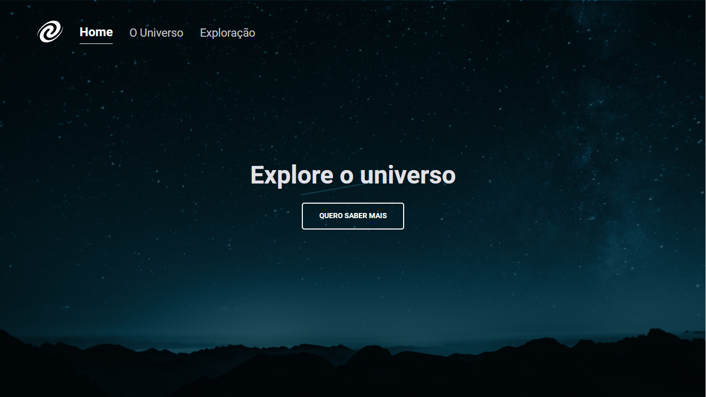

# spa-universe

Desafio "SPA Universe" do Explorer da Rocketseat, cujo objetivo foi a criação de uma página de exploração do universo utilizando o conceito de Single Page Application (SPA).

O que foi abordado nesse desafio:

- Conceitos de SPA;
- Mapeamento de rotas;
- Assincronismo e promises;
- Orientação a objetos;
- Classes e muito mais.